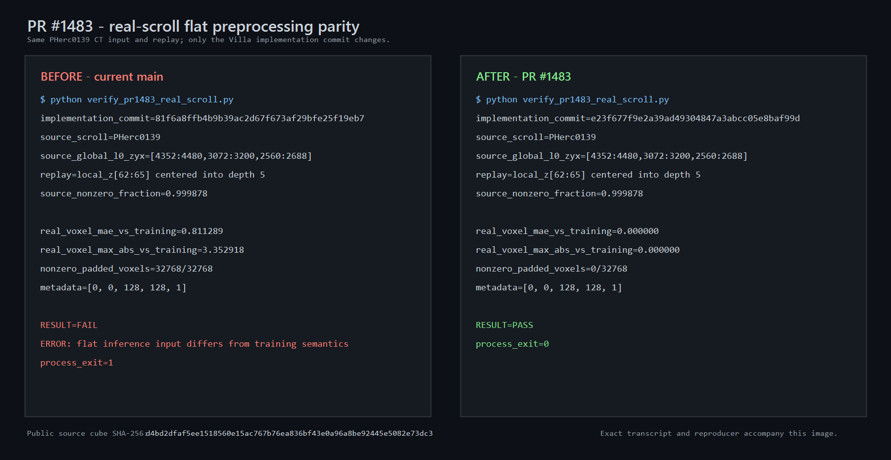

# PR #1483 real-scroll preprocessing evidence

This branch hosts supporting evidence for
[ScrollPrize/villa#1483](https://github.com/ScrollPrize/villa/pull/1483) without
adding evidence files to that PR's focused two-file code diff.

The replay uses real CT values from the public PHerc0139 L0 volume:

`s3://vesuvius-challenge-open-data/PHerc0139/volumes/20250728140407-9.362um-1.2m-113keV-masked.zarr`

- source cube coordinates (Z/Y/X): `[4352:4480, 3072:3200, 2560:2688]`
- extracted TIFF: `z04352_y03072_x02560.tif`
- TIFF SHA-256: `d4bd2dfaf5ee1518560e15ac767b76ea836bf43e0a96a8be92445e5082e73dc3`
- replayed source: local Z `[62:65]`, centered in a five-slice model input



The image is a side-by-side rendering of the exact output in
[`pr1483_real_scroll_before_after.txt`](pr1483_real_scroll_before_after.txt).
The validation program is
[`verify_pr1483_real_scroll.py`](verify_pr1483_real_scroll.py).

Run the program from a Villa checkout whose `vesuvius/src` is on
`PYTHONPATH`, passing the extracted TIFF path:

```text
python verify_pr1483_real_scroll.py PATH/TO/z04352_y03072_x02560.tif
```

It executes Villa's actual `FlatPatchReader` and `FlatBlockDataset`. At current
main commit `81f6a8ffb4b9b39ac2d67f673af29bfe25f19eb7`, it exits 1 because the
inference tensor differs from training semantics. At PR commit
`e23f677f9e2a39ad49304847a3abcc05e8baf99d`, it exits 0 with exact parity.

This validates deterministic input preprocessing on real scroll CT. It is not
an ink-accuracy or model-quality claim.
